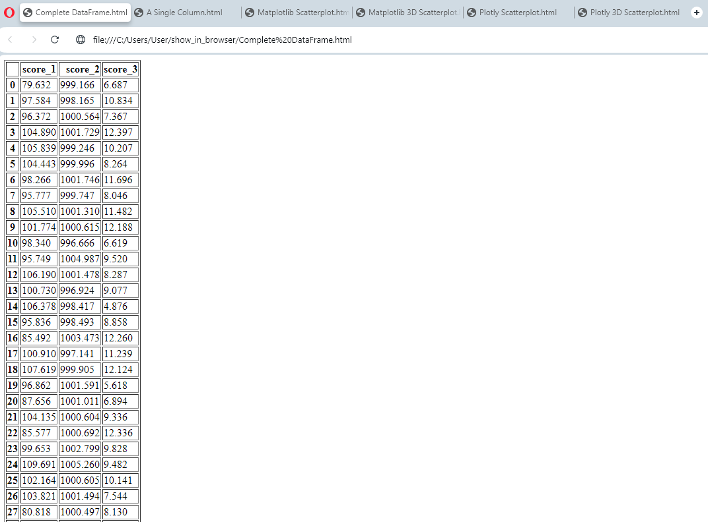
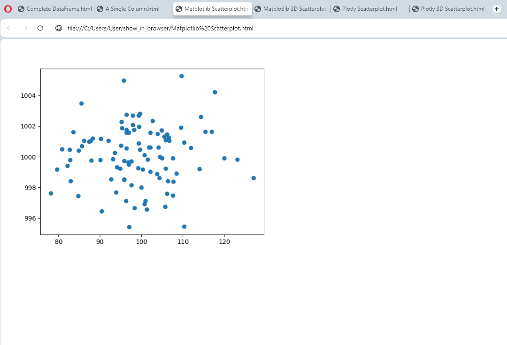
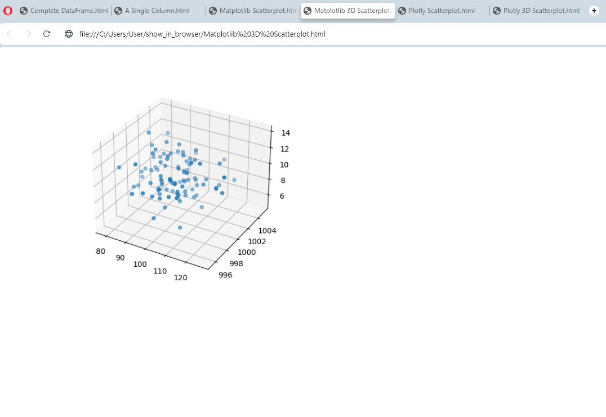

# df_in_browser

A simple python package to display pandas dataframes and matplotlib/plotly graphs
in a browser. This package is intended to be used from the command line, for better
visualisation of dataframes than viewing within the terminal. (E.g. to allow viewing of 
the entire dataframe, scrolling etc). In addition, plots appear sequentially as 
separate browser tabs, so they can be viewed in an intended sequence.

The following code shows some example uses (in an ipython session):

```
# import the show_in_browser functions as on the line below:
from show_in_browser import show_df, show_plt_plot, show_px_plot

# other imports for the demo script
import pandas as pd
import numpy as np
import matplotlib.pyplot as plt
import plotly.express as px

# ==============================================================================
# SHOW DATAFRAMES IN THE BROWSER
# this section shows how to use the `show_df()` function to display a dataframe
# in the browser

# create dataframe
df = pd.DataFrame({'score_1': np.random.normal(100, 10, 100),
                'score_2': np.random.normal(1000, 2, 100),
                'score_3': np.random.normal(10, 2, 100)})

# show a DataFrame in a browser
show_df(df, name='Complete DataFrame') # name is optional

# show a Series derived from the DataFrame in a browser
show_df(df['score_1'], name='A Single Column') # name is optional

# ==============================================================================
# SHOW MATPLOTLIB PLOTS IN THE BROWSER
# this section shows how to use the `show_plt_plot()` function to display a
# matplotlib plots in the browser

# 2D matplotlib plot
plt.figure()
plt.scatter(df['score_1'], df['score_2'])
show_plt_plot(name='Matplotlib Scatterplot') # name is optional

# 3D matplotlib plot
fig = plt.figure()
ax = fig.add_subplot(111, projection='3d')
ax.scatter(df['score_1'], df['score_2'], df['score_3'])
show_plt_plot(name='Matplotlib 3D Scatterplot') # name is optional

# ==============================================================================
# SHOW PLOTLY PLOTS IN THE BROWSER
# this section shows how to use the `show_px_plot()` function to display a
# matplotlib plots in the browser

# 2D plotly plot
fig = px.scatter(df, x='score_1', y='score_2')
show_px_plot(fig, name='Plotly Scatterplot') # name is optional

# 3D plotly plot
fig = px.scatter_3d(df, x='score_1', y='score_2', z='score_3')
show_px_plot(fig, name='Plotly 3D Scatterplot') # name is optional
```
This code will give you output of the following form, in your default browser. 
E.g. each dataframe or plot that you have selected will show in separate tabs
in your default browser. (They will appear in the order in which you ran the
commands):









